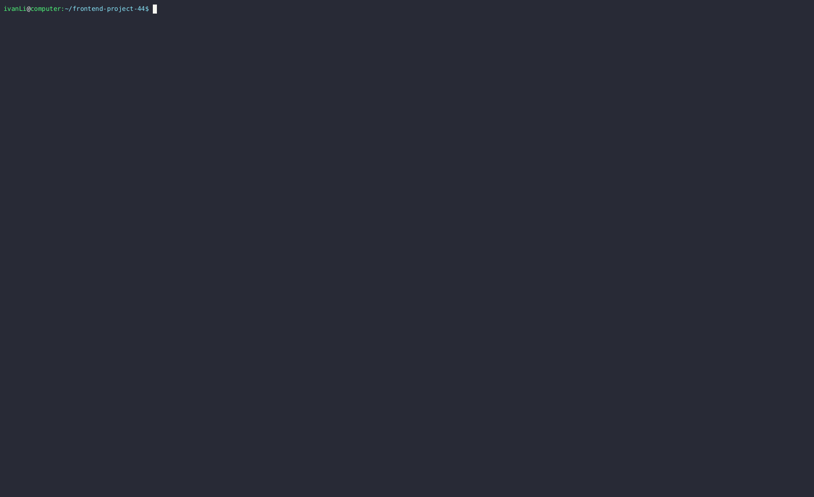
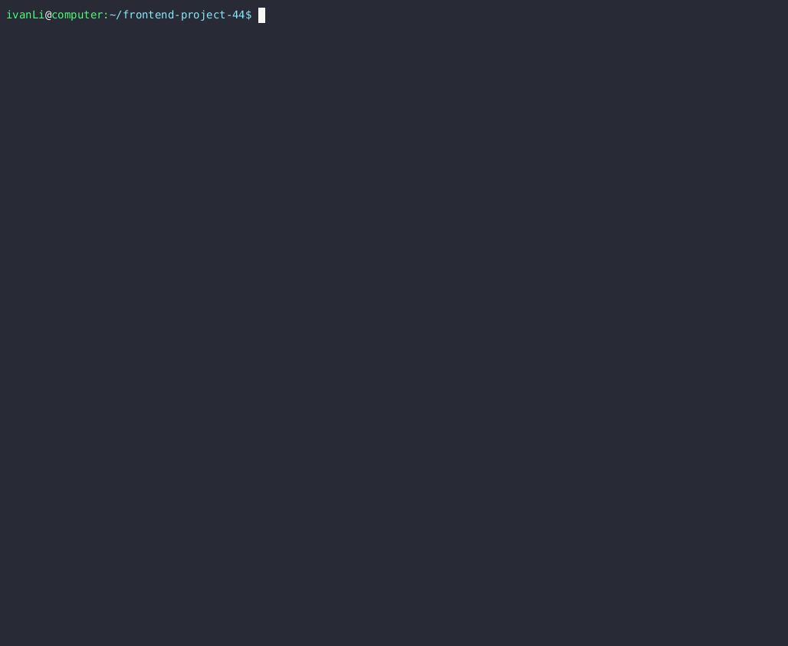
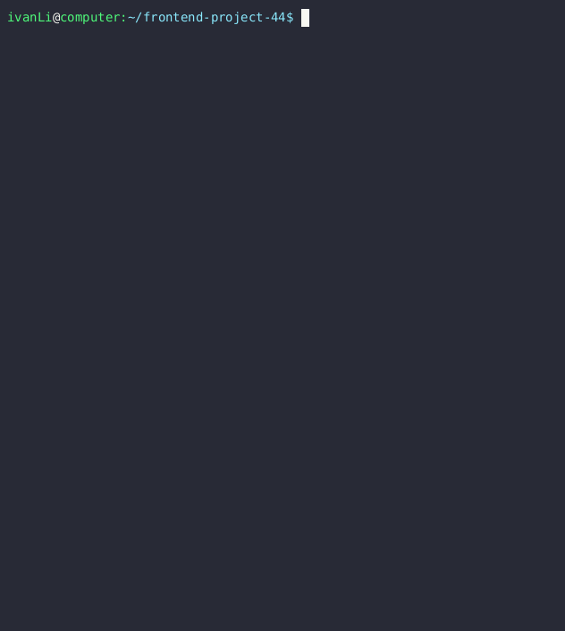

### Hexlet tests and linter status:

# CodeClimat

# Link to asciinema session evenGame 

# Link to asciinema session calcGame
 

 # Link to asciinema session gcdGame
  

# Video demonstration of the application even in action

# Video demonstration of the application calc in action

# Video demonstration of the application gcd in action
